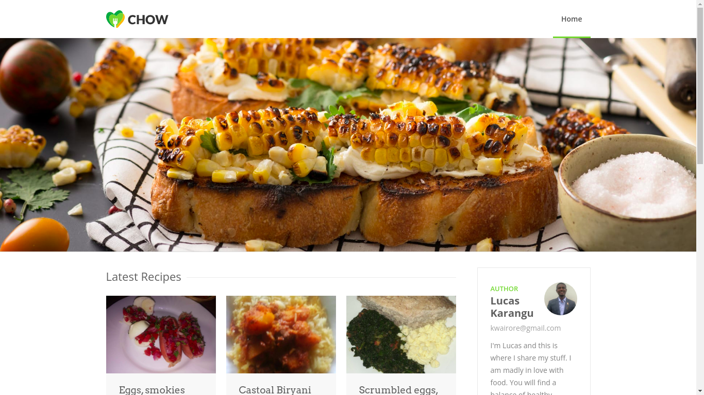
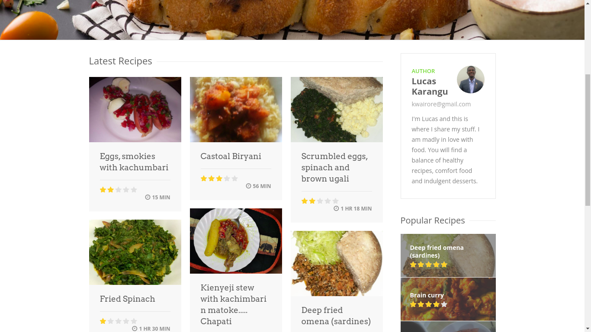
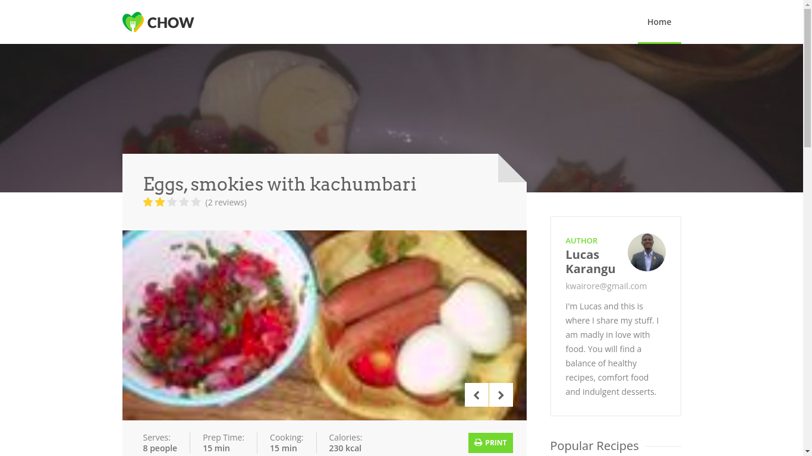
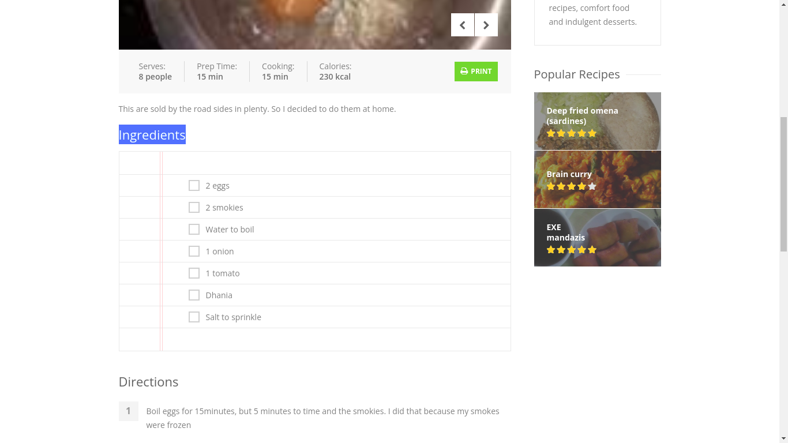

# Angular Recipe App
Discover recipes, cooks and how-tos based on the Kenyan food you love.

# Demo
Here is a working live demo: [https://lwairore.github.io/angular-recipe/](https://lwairore.github.io/angular-recipe/)

## Homepage

### Latest recipe section

## Recipe details page

### Ingredients section

# Built with
- [Angular](https://angular.io/)

# Reading resources
- [Angular](https://angular.io/) - Angular is a front-end web framework built by Google. It allows developers to build a single-page applications modeled around a *model-view-controller* (MVC) or *model-view-viewmodel*(MVVM) software architectural pattern. This architecture divides applications into different, but connected parts allowing for parallel development. Following this pattern, Angular splits its different components into the respective parts of a web application. Its components manage the data and logic that pertain to that component, display the data in its respective view, and adapts or controls the view based on the different messages that it receives from the rest of the app.

# Team
[Karangu Lucas](https://github.com/lwairore)
